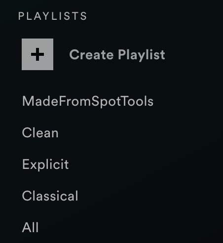

# Spotitools

## Initial Login
When you first load up the site, you will see the following login dialog box. This box requests you to login to Spotify and grant the site access to your like songs. Once you perform this once, you will not have to do this again until either your token expires, or you delete your cookies.

 

## Homepage 
Finally, you will see the following page. Here you can see all of your liked songs in a minimalistic manner. Hit submit to move forward.

 

Finally, you will have options to show only songs with certain characteristics, such as Explicit, Clean, and Acousticness. In additon, you have the option to truly randomize your songs. Spotify shuffles in manner such that the more popular a song is, the more frequently it will be played, so truly randomization is a useful feature to have!

 

If we want to fit more songs on the screen and do not need to see the album artwork, we can simply deselect the function in the menu.

 

To view all parameters about a song, simply hover your cursor over the album artwork. The artwork will darken in color and you can see all relevant parameters. This is more information about a song than Spotify normally allow you to see!

 

If you hover over the title of a song:

 

It changes the song that shows up in the playback minibar in the menu to the one you clicked. Not only can you tweak your playlist, but you can play your songs from within the site as well!

 

Finally, once you have fine tuned a playlist just the right way, you can type in a playlist name into "Playlist to save songs."
As seen below, we have typed in "MadeFromSpotTools" and it showed up in our playlist!

 

## About
You can view all information about unique parameters, their values, and what they mean in a gorgeous table on the About Page!

 

## Feedback
If you would like to see any feedback others have given, go the Feedback page. Here, you will find neatly organized posts with users' names, profile pictures and post content sorted by time posted (newest first). 

 

To view a single post, click the post title as seen here:

 

You will see a page similar to this:

 

Click on a username like this:

 

In order to view all posts made by that user:

 

## Login
If you would like to leave feedback yourself, please login to an account by clicking login:

 

We use hashes and salts to verify your password-username combo, not the values themselves in order to keep your information crytographically secure. Even if an hacker hacks our database, they won't be able to gain access to your account.

## Register

Never created an account? Register now!

 

## Profile
You can view your site profile, and update any information in it, such as your profile picture, in the profile tab:

 

## Logout
Simply click the logout button at any time to logout of your site account. If successful, you should see the following:

 

