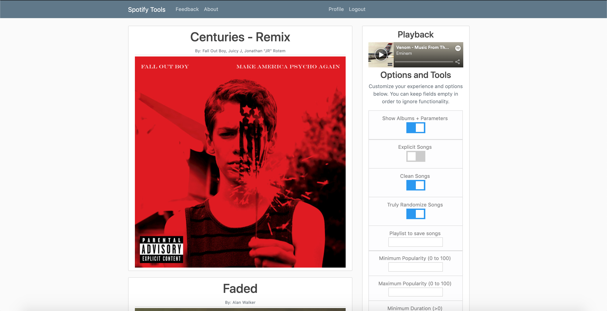

# Spotitools

When you first load up the site, you will see the following login dialog box. This box requests you to login to Spotify and grant the site access to your like songs. Once you perform this once, you will not have to do this again until either your token expires, or you delete your cookies.

Finally, you will see the following page. Here you can see all of your liked songs in a minimalistic manner. Hit submit to move forward.

Finally, you will have options to show only songs with certain characteristics, such as Explicit, Clean, and Acousticness. In additon, you have the option to truly randomize your songs. Spotify shuffles in manner such that the more popular a song is, the more frequently it will be played, so truly randomization is a useful feature to have!

If we want to fit more songs on the screen and do not need to see the album artwork, we can simply deselect the function in the menu.

To view all parameters about a song, simply hover your cursor over the album artwork. The artwork will darken in color and you can see all relevant parameters. This is more information about a song than Spotify normally allow you to see!

Finally, once you have fine tuned a playlist just the right way, you can type in a playlist name into "Playlist to save songs."
As seen below, we have typed in "MadeFromSpotTools" and it showed up in our playlist!

 

